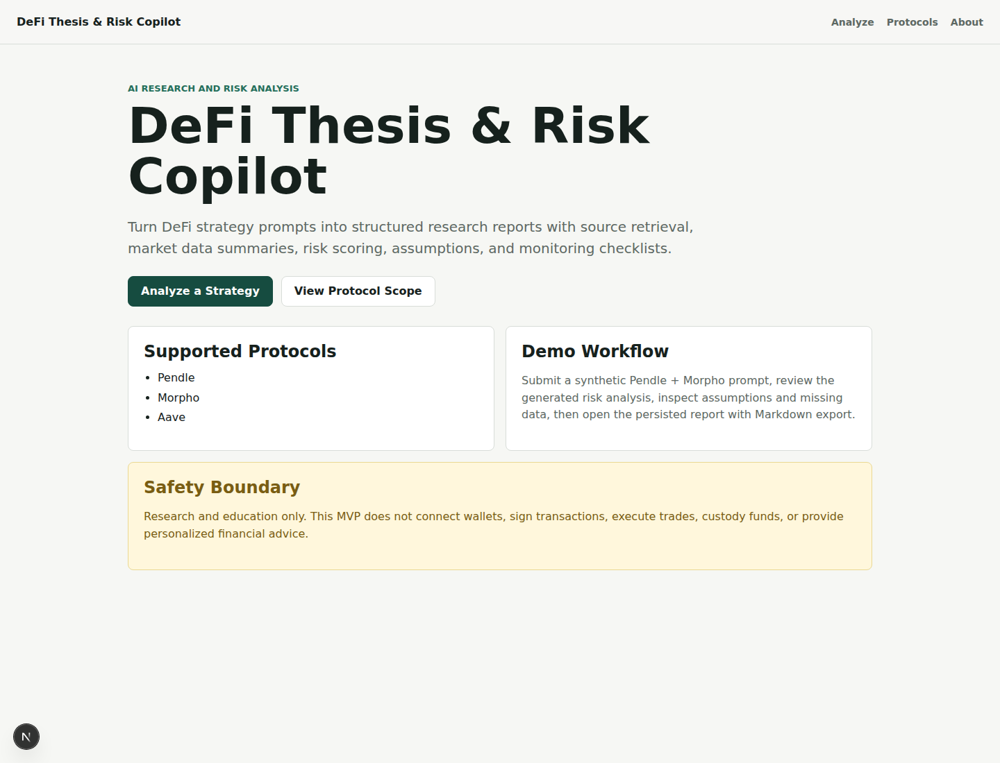
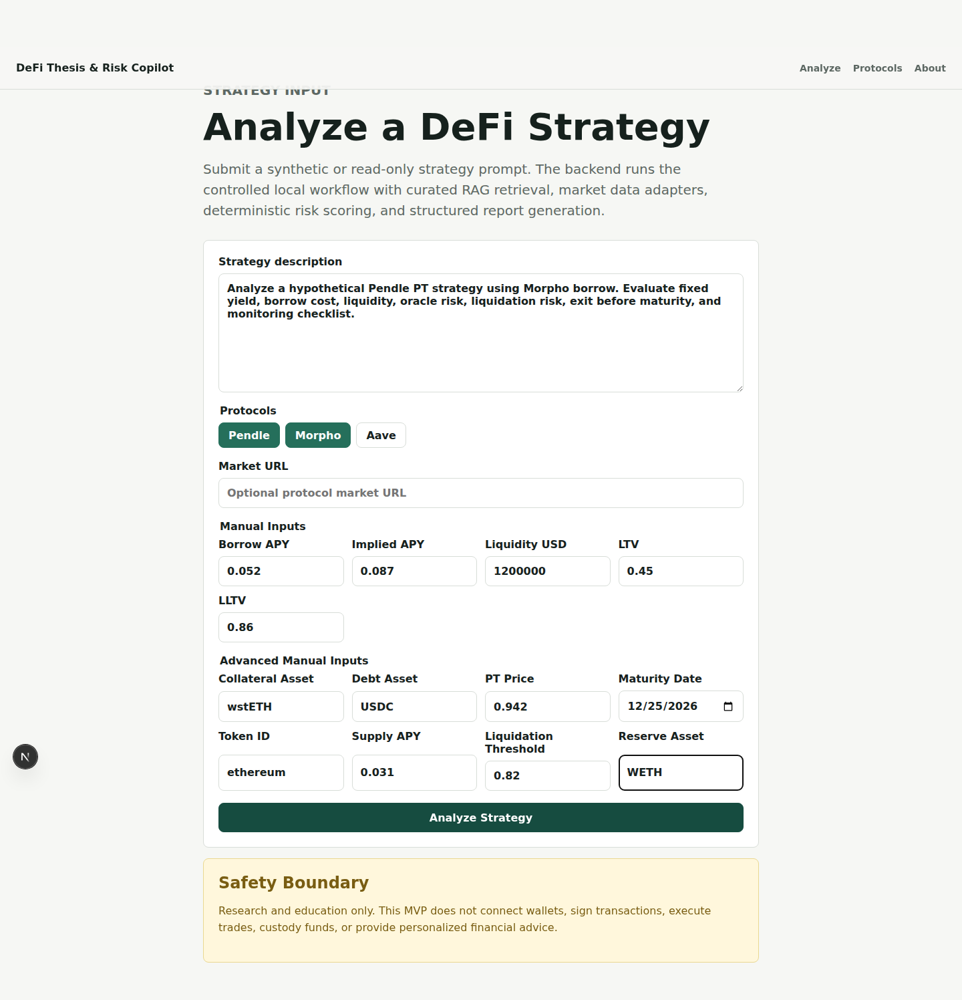
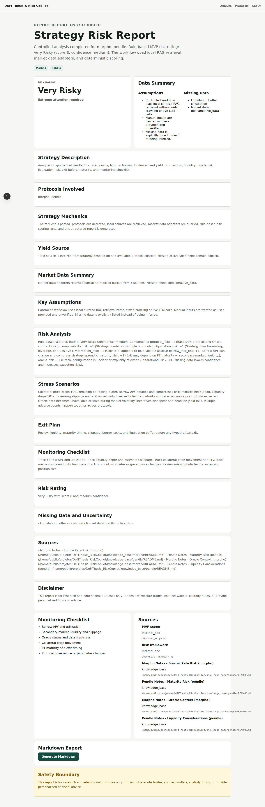
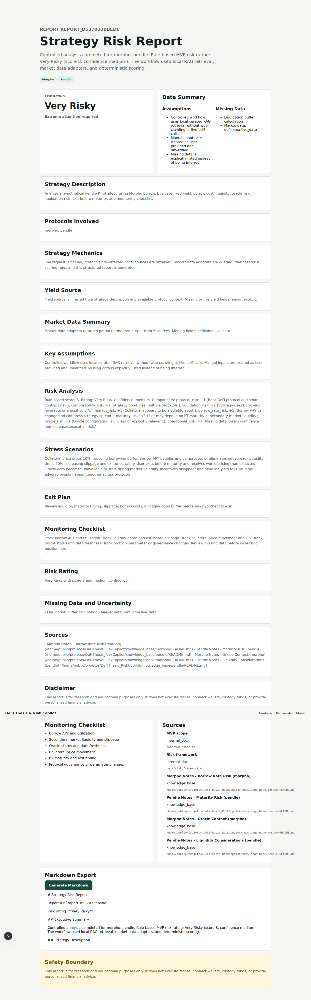

# DeFi Thesis & Risk Copilot

[](https://github.com/publiomcko-cloud/defi-thesis-risk-copilot/actions/workflows/ci.yml)

AI-powered DeFi research and risk analysis copilot for protocol theses, yield strategies, lending markets, and structured risk reports.

DeFi Thesis & Risk Copilot combines RAG, protocol documentation, market data adapters, controlled agentic workflows, rule-based risk scoring, and optional future LLM synthesis to help users analyze complex DeFi strategies before execution.

## Portfolio Description

Full-stack AI and DeFi portfolio app with FastAPI, Next.js, RAG, controlled agent workflows, market data integrations, risk scoring, structured report generation, Docker, and CI.

## Current Status

The technical MVP is complete through Phase 10:

```text
Phase 6: market data adapters
Phase 7: rule-based risk framework
Phase 8: controlled agent orchestration
Phase 9: structured reports and Markdown export
Phase 10: Docker, local environment, and CI
```

Active development now moves to the post-MVP product-expansion phases described in [`docs/post_mvp_development_plan.md`](docs/post_mvp_development_plan.md).

The original MVP phases 11, 12, and 13 are intentionally left until the end because they are final demo data, public deployment, and portfolio-polish actions.

## Live Portfolio Demo

- Frontend: pending
- Backend health: pending
- API docs: pending
- Demo video: pending
- Downloadable walkthrough: pending

The first public demo should use synthetic examples and read-only public data. The application does not connect wallets, sign transactions, execute trades, or custody funds.

## Demo Safety

- No wallet connection is implemented.
- No transaction execution is implemented.
- No private keys, seed phrases, or user funds are handled.
- Market data may be delayed, incomplete, cached, user-provided, or simulated.
- Reports are for research and educational purposes only.
- The system does not provide financial, investment, legal, or tax advice.

## For Recruiters

DeFi Thesis & Risk Copilot is designed to demonstrate applied AI engineering judgment, not only isolated chatbot behavior.

It demonstrates:

1. Retrieval-augmented generation over protocol documentation.
2. Controlled agent workflow orchestration for research, data collection, risk scoring, and report writing.
3. DeFi domain modeling around Pendle, Morpho, Aave, lending markets, fixed-yield assets, collateral risk, and liquidation risk.
4. Backend API design with typed schemas and modular services.
5. Frontend product flow for analysis input, report review, and portfolio-ready demo screens.
6. Dockerized local development and CI.
7. Documentation-first engineering with architecture, testing, deployment, and roadmap notes.

Recommended review path:

1. Read the README and project case study.
2. Open the demo dashboard.
3. Submit the example Pendle + Morpho strategy prompt.
4. Review the generated risk report.
5. Inspect the retrieved sources and assumptions.
6. Review the backend API docs.
7. Inspect the repository architecture and post-MVP development plan.

## For Clients

This project models how a crypto research team, DeFi community, analyst, or advanced user could use AI to standardize strategy review before capital allocation.

Client-facing value:

- structured DeFi research reports
- repeatable strategy risk analysis
- source-backed protocol explanations
- monitoring checklist generation
- risk classification without trade execution
- safe educational workflow for complex strategies
- extensible architecture for custom dashboards, source monitoring, watchlists, alerts, and strategy simulation

## What It Demonstrates

- FastAPI backend with modular agents, data adapters, RAG, and risk services
- Next.js frontend with strategy input, report page, and dashboard-oriented UX
- RAG over protocol documentation and internal DeFi risk notes
- Controlled workflow for protocol research, data collection, risk scoring, and report generation
- Rule-based risk scoring for DeFi strategies
- Public data integrations and adapter fallbacks for DefiLlama, CoinGecko, Pendle, Morpho, Aave, and manual inputs
- Structured report generation with assumptions, risks, missing data, sources, and disclaimers
- Markdown export
- Docker-based local execution and CI validation
- Future-ready structure for LLM synthesis, source monitoring, automated evaluation, watchlists, options analysis, fine-tuning, and HPC batch processing

## Core Demo Flow

```text
strategy input
  -> protocol detection
  -> RAG source retrieval
  -> market data lookup
  -> risk scoring
  -> stress scenario generation
  -> structured report
  -> markdown export
```

Example prompt:

```text
Analyze a hypothetical Pendle PT strategy using Morpho borrow. Evaluate fixed yield, borrow cost, liquidity, oracle risk, liquidation risk, exit before maturity, and monitoring checklist.
```

## Screenshots

Evaluation screenshots are available in `docs/screenshots/evaluation/`.

| Home | Analyze |
| --- | --- |
|  |  |

| Report | Markdown export |
| --- | --- |
|  |  |

## Deployment Architecture

```text
Browser
  -> Vercel Next.js frontend
  -> Render FastAPI backend
  -> Supabase PostgreSQL
  -> Vector database or pgvector
  -> Optional hosted LLM provider
```

Local development can run with Docker Compose using PostgreSQL, backend, frontend, local RAG files, and optional local LLM services in future phases.

## Local Quick Start

Start the local Docker services:

```bash
docker compose up -d --build
```

Verify the app:

```bash
curl http://127.0.0.1:8000/health
```

Open:

```text
Frontend: http://127.0.0.1:3000
Backend health: http://127.0.0.1:8000/health
API docs: http://127.0.0.1:8000/docs
```

Stop the local stack:

```bash
docker compose down
```

Manual backend setup, using the default local SQLite database:

```bash
cd backend
python3 -m venv .venv
source .venv/bin/activate
pip install -r requirements.txt
alembic upgrade head
uvicorn app.main:app --reload
```

Manual frontend setup:

```bash
cd frontend
npm install
npm run dev
```

## Validation

Backend:

```bash
cd backend
source .venv/bin/activate
python -m pytest -q
python scripts/run_smoke_checks.py
```

Frontend:

```bash
cd frontend
npm run lint
npm run build
```

RAG validation:

```bash
cd backend
python scripts/evaluate_retrieval.py
```

Production-like Docker configuration check:

```bash
docker compose config
docker compose -f docker-compose.production.yml config
```

## Important Endpoints

Current MVP endpoints:

- `GET /health`
- `POST /api/analyze`
- `GET /api/reports/{report_id}`
- `POST /api/reports/{report_id}/export`
- `GET /api/protocols`
- `POST /api/documents/ingest`
- `POST /api/market-data/fetch`

Planned post-MVP endpoints:

- `POST /api/monitoring/run`
- `GET /api/monitoring/discovered-items`
- `POST /api/evaluation/run`
- `GET /api/review/items`
- `POST /api/simulation/run`
- `GET /api/watchlist`
- `POST /api/options/analyze`

## Documentation

- [Changelog](CHANGELOG.md)
- [Current state](docs/current_state.md)
- [Architecture](docs/architecture.md)
- [MVP scope](docs/mvp_scope.md)
- [Post-MVP development plan](docs/post_mvp_development_plan.md)
- [Case study](docs/case_study.md)
- [Data sources](docs/data_sources.md)
- [RAG design](docs/rag_design.md)
- [Agent design](docs/agent_design.md)
- [Risk framework](docs/risk_framework.md)
- [Demo architecture](docs/demo_architecture.md)
- [Demo script](docs/demo_script.md)
- [Deployment](docs/deployment.md)
- [Testing](docs/testing.md)
- [Portfolio readiness](docs/portfolio_readiness.md)
- [Development plan](docs/development_plan.md)

Archive:

- [Historical development plan](docs/archive/development_plan.md)

## Known Limitations

- The application does not execute trades.
- The application does not connect wallets.
- The application does not provide personalized financial advice.
- Market data may be incomplete, cached, delayed, or user-provided.
- Some protocol-specific metrics still require manual input.
- Risk scoring is rule-based and should not be treated as a quantitative guarantee.
- RAG answers depend on the quality and freshness of ingested documents.
- Report writing is deterministic and template-based until optional LLM synthesis is implemented.
- No production authentication or billing system is included.

## Roadmap

Completed MVP foundation:

- Implement MVP analysis workflow for Pendle, Morpho, and Aave.
- Add documentation ingestion and local retrieval.
- Add market data adapter layer.
- Add deterministic risk scoring.
- Add controlled agent orchestration.
- Add structured report generation and Markdown export.
- Add Docker and CI.

Active post-MVP product expansion:

- Add optional backend LLM report synthesis.
- Add source monitoring and discovery.
- Add automated evaluation pipeline and human review queue.
- Add strategy simulator.
- Add watchlists and in-app alerts.
- Add Derive-style options and volatility analysis.
- Add advanced RAG, semantic embeddings, reranking, and retrieval evaluation.
- Add fine-tuning and ML risk classifier groundwork.
- Add SLURM and Apptainer support for HPC batch jobs.

Final portfolio phases:

- Add demo data and example reports.
- Deploy the public portfolio demo.
- Polish README, screenshots, demo video, and case study.

## License

This project is intended to be available under the MIT License.
